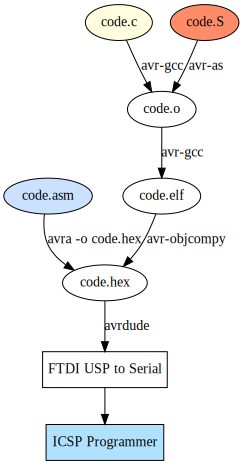

# Miscellaneous Arduino projects in C and ASM

These are notes on how to build and make working projects without involving any IDE magic using
only C/C++ compiler, Assembly and flashing.

## Toolchain

###  Assembly syntax

There are a few different assembly languages available to choose from:

  - GNU's Assembler (`avr-as`);
  - Gerd's AVR Assembler (`gavrasm`)
  - Assember for the Atmel AVR microcontroller family (`avra`)
  - Atmel's Assembler (part of [Atmel Studio](https://www.microchip.com/mplab/avr-support/atmel-studio-7))

They each have slightly different syntaxes and command lines for getting the source assembled.
Here's a minimal example for each; they turn on pin PB5 (digital pin 13, which had an LED connected to it on the board).

<table>
  <thead>
    <tr>
      <th>Assembly</th>
      <th>Code/Command Line</th>
      <th>Notes</th>
    <tr>
  </thead>
  <tbody>
    <tr>
      <td rowspan="2">
        GNU's
      </td>
      <td>
        TODO:
      </td>
      <td rowspan="2">
GNU's assembler is conveniently included in the <a href="https://www.obdev.at/products/crosspack/index.html">CrossPack</a> package for Mac OS X, WinAVR for Windows, and the gcc-avr packages on various Linux distributions. Unfortunately, it has awkward syntax, requiring <code>_SFR_IO_ADDR()</code> around the names of the I/O registers. Confusingly, you'll need to compile your code with avr-gcc, even though it's assembly. If you try avr-as, you'll get a message like "Error: constant value required".
      </td>
    </tr>
    <tr>
      <td>
        <pre>
avr-gcc -c -mmcu=atmega328p -o code.o code.S
avr-objcopy -j .text -O ihex code.o code.hex
        <pre>
      </td>
    </tr>
    <tr>
      <td rowspan="2"><a href="/hsoft/avra">avra</a></td>
      <td><pre>;specify the device:
.device ATmega328P
;OR use definition:
;.include "./m328Pdef.inc"
    sbi 0x24, 5
    sbi 0x25, 5
loop:
    rjmp loop  ; pevents running out</pre>
      </td>
      <td rowspan="2">
Another open-source assembler that is compatible with Atmel's AVRASM32. It has the advantage of being written in C, so you can compile it with the standard development tools (e.g. Xcode on the Mac). There are also Windows binaries available.
You will need to download or define yourself macros for your chip (included in AVR Studio). For instance, avra doesn't support newer AVRs like the ATtiny44A that was on our boards this week. To use it, you'll need the .inc file for your microcontroller (e.g. tn45def.inc for the ATtiny45). And then you could use defined macros instead of absolute addresses, for example, in case of ATmega328P, using "m328Pdef.inc", <b>DDRB</b> instead of <b>0x24</b>.
      </td>
    </tr>
    <tr>
      <td>Atmel's Assembler</td>
    </tr>
    <tr>
      <td><a href="/hsoft/avra">avra</a></td>
      <td><pre>;specify the device:
.include "m328Pdef.inc"
    sbi DDRB, 5
    sbi PORTB, 5
loop:
    rjmp loop  ; pevents running out</pre>
      </td>
      <td>
The official (Windows only) AVR assembler from Atmel (avrasm).
You should be able to compile your code from within 
<a href="https://www.microchip.com/mplab/avr-support/atmel-studio-7">Atmel Studio</a>.
      </td>
    </tr>
  </tbody>
</table>

## More Reading

 * avra: [Assember for the Atmel AVR microcontroller family](https://github.com/hsoft/avra)
 * avrdude: [AVR Downloader/UploaDEr](http://savannah.nongnu.org/projects/avrdude/)
 * [How to write C & Assembly together](https://www.pantechsolutions.net/how-to-write-c-assembly-together)
 * [AVR Assembler Tutorial](https://www.instructables.com/id/Command-Line-Assembly-Language-Programming-for-Ard/)
 * [Gerd's AVR assembler gavrasm](http://www.avr-asm-tutorial.net/gavrasm/index_en.html)
 * [Atmel AVR instruction set](https://en.wikipedia.org/wiki/Atmel_AVR_instruction_set)
 * [AVR C Runtime Library](https://www.nongnu.org/avr-libc/)
 
