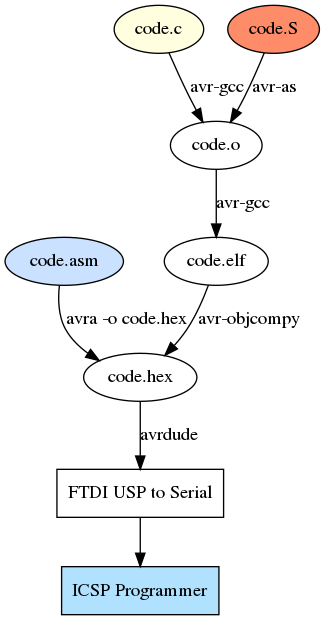

# Miscellaneous Arduino projects in C and ASM

These are notes on how to build and make working projects without involving any IDE magic using
only C/C++ compiler, Assembly and flashing.

## Toolchain

###  Assembly syntax

There are a few different assembly languages available to choose from:

  - GNU's Assembler (`avr-as`);
  - Gerd's AVR Assembler (`gavrasm`)
  - Assember for the Atmel AVR microcontroller family (`avra`)
  - Atmel's Assembler (part of [Atmel Studio](https://www.microchip.com/mplab/avr-support/atmel-studio-7))

They each have slightly different syntaxes and command lines for getting the source assembled.
Here's a minimal example for each; they turn on pin PB5 (digital pin 13, which had an LED connected to it on the board).

| Assembly  | Code | Command Line | Notes |
<table>
  <thead>
    <tr>
      <th>Assembly</th>
      <th>Code/Command Line</th>
      <th>Notes</th>
    <tr>
  </thead>
  <tbody>
    
  </tbody>
</table>

## More Reading

 * avra: [Assember for the Atmel AVR microcontroller family](https://github.com/hsoft/avra)
 * avrdude: [AVR Downloader/UploaDEr](http://savannah.nongnu.org/projects/avrdude/)
 * [How to write C & Assembly together](https://www.pantechsolutions.net/how-to-write-c-assembly-together)
 * [AVR Assembler Tutorial](https://www.instructables.com/id/Command-Line-Assembly-Language-Programming-for-Ard/)
 * [Gerd's AVR assembler gavrasm](http://www.avr-asm-tutorial.net/gavrasm/index_en.html)
 * [Atmel AVR instruction set](https://en.wikipedia.org/wiki/Atmel_AVR_instruction_set)
 * [AVR C Runtime Library](https://www.nongnu.org/avr-libc/)
